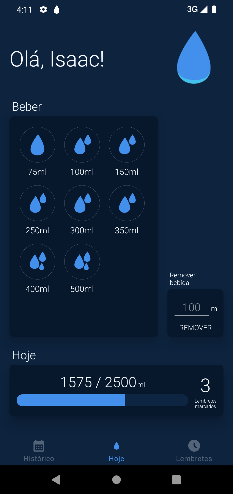
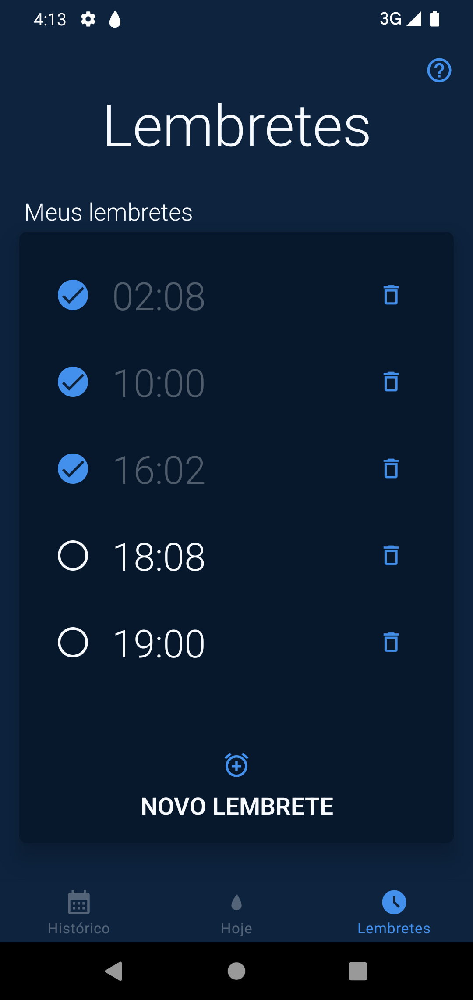
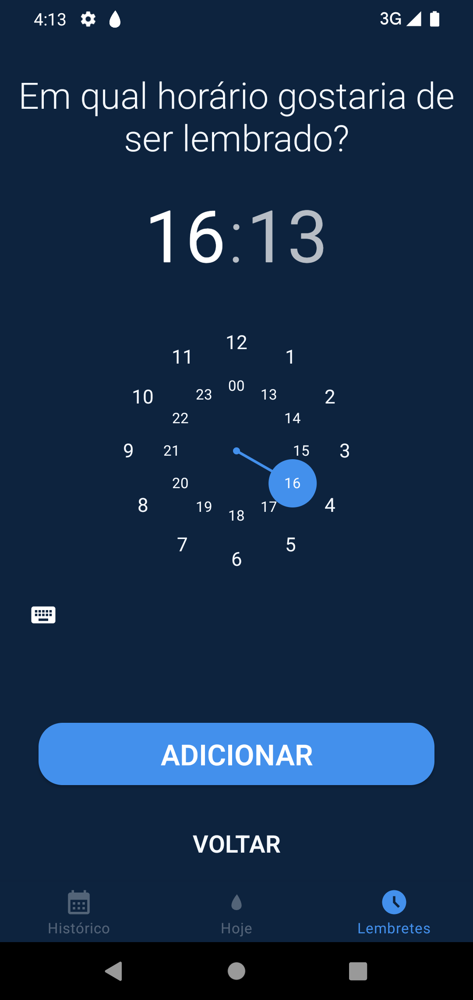
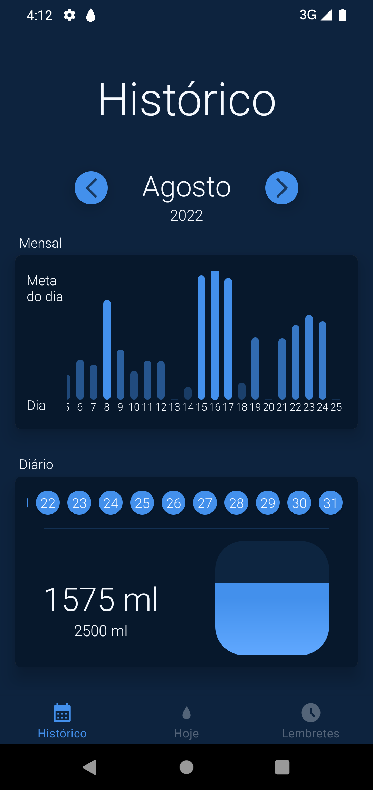
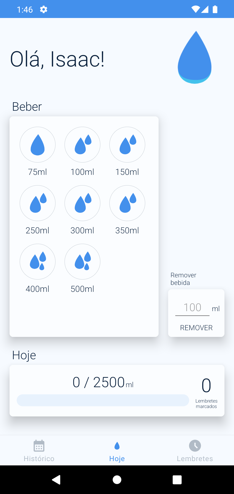
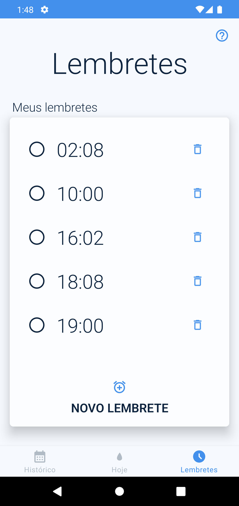
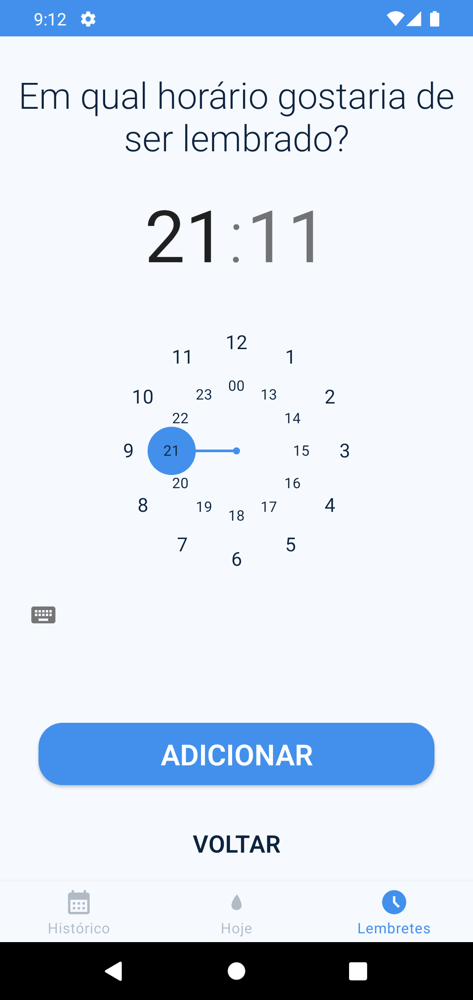
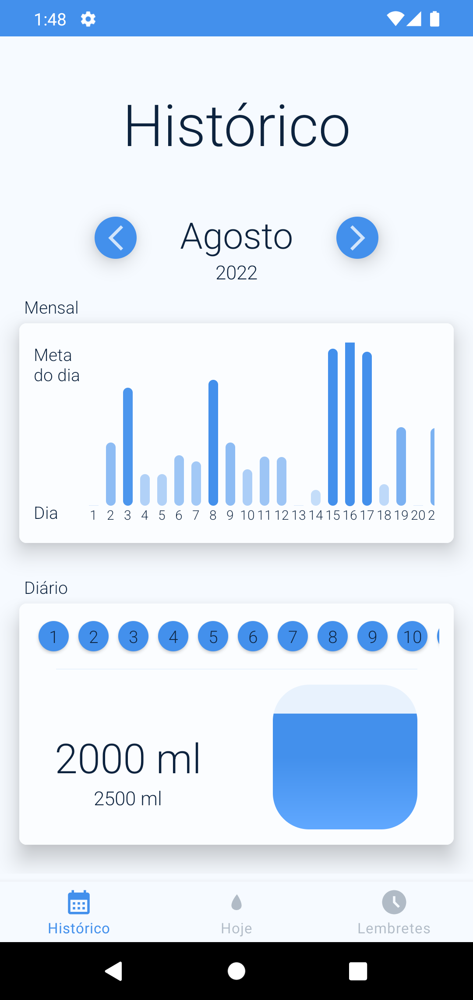

# Water Reminder 

### WaterReminder is an app where you can manager your water consumption. For this, the app have 3 functionalities:
 - Today: You can manager you water consumption in the day.
 - History: You can see your water consumption history.
 - Reminder: You can schedule reminders for all day to remember you to drink water
 
## Objective
 - This app was build to study Android Development and, in future, publish in Play Store for get real feedbacks and improvement the features and User Experience.

## Concepts used
 - Alarms
 - Notifications
 - Coroutines for Asynchronous tasks
 - Room 
 - Reactive Programing with Flow
 - Dependency Injection using Koin
 - Solid principles
 - Navigation and pass arguments
 - CustomView
 - DataStore
 - RecyclerView
 - MVVM Architecture
 - Motion layout and Animation
 - Dark Mode Theme and styles

## Architecture Diagram

## Video

## Screens
### Dark Mode

### Light Mode

## Next steps
 - Tests
 - Translate to English

