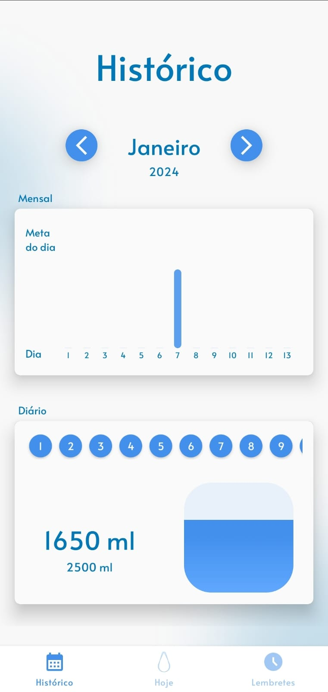

# Water Reminder 

### WaterReminder is an app where you can manager your water consumption. For this, the app have 3 functionalities:
 - Today: You can manager you water consumption in the day.
 - History: You can see your water consumption history.
 - Reminder: You can schedule reminders for all day to remember you to drink water
 
## Objective
 - This app was build to study modern Android Development and other things like ads, UX and user retention

## Concepts used
  - MVVM Architecture
  - Solid principles
  - Coroutines for Asynchronous tasks
  - Reactive Programing with Flow
  - Dependency Injection using Koin
  - Database ( Room )
  - Firebase Analytics
  - Firebase Messaging
  - Ads ( admob )
  - Alarms
  - Notifications
  - Navigation and pass arguments
  - CustomView
  - DataStore
  - RecyclerView
  - Motion layout and Animation
  - Dark Mode Theme and styles

## Architecture Diagram

## Video

## Screens

## Next steps
 - Finish CI/CD Setup
 - Modularization

